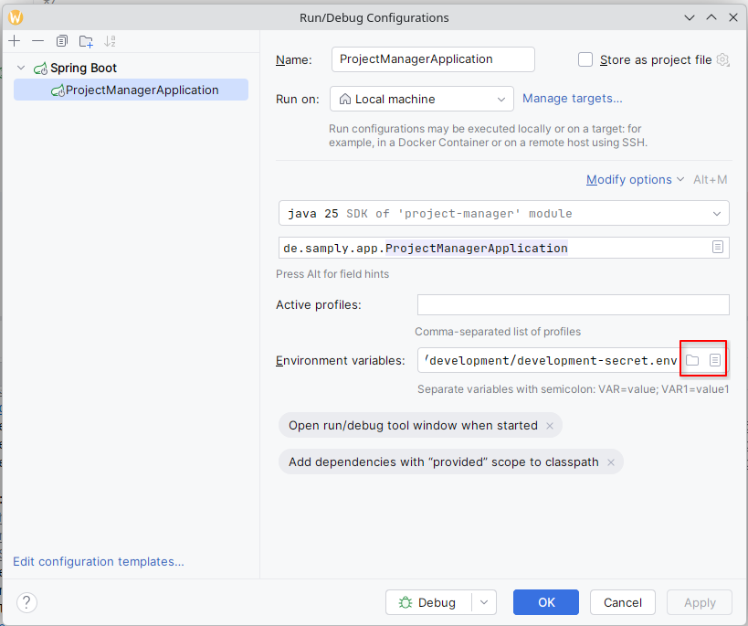
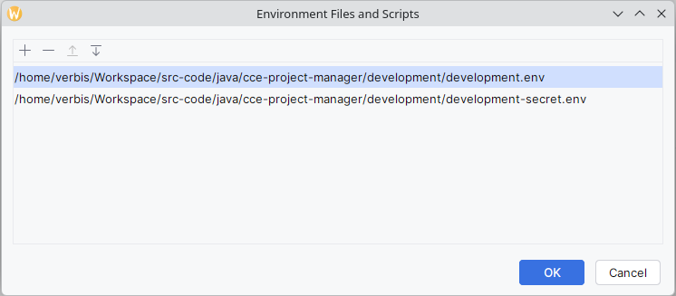
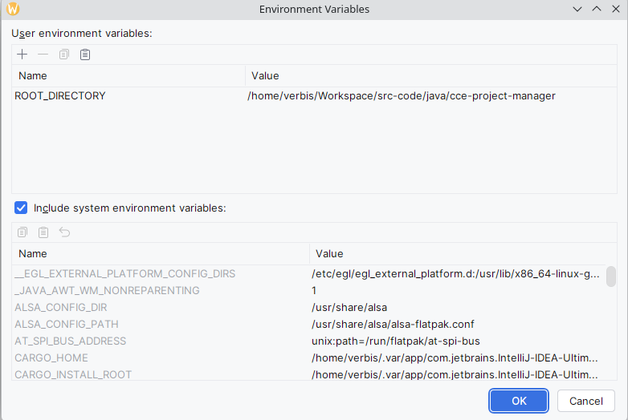

# Project Manager

## How to run

### Environment variables

We need to configure certain environment variables. In IntelliJ, go to:



and add the below 2 directories, by clicking on the directory icon:



**Note:** The path on your machine could be different, but the relative paths should be:

```shell
cce-project-manager/development/development.env
cce-project-manager/development/development-secret.env
```

Apart from the above 2 directories, you also need to add a `ROOT_DIRECTORY` env var:



### Database

We need to configure a database before we can run the application. We use PostgreSql, and we need to run the following before running the application:

```sql
sudo -u postgres psql

CREATE USER project_manager WITH PASSWORD 'project_manager';
CREATE DATABASE project_manager OWNER project_manager;
\c project_manager

CREATE SCHEMA samply AUTHORIZATION project_manager;
ALTER DATABASE project_manager OWNER TO project_manager;

ALTER SCHEMA samply OWNER TO project_manager;
GRANT ALL ON SCHEMA samply TO project_manager;

ALTER DEFAULT PRIVILEGES IN SCHEMA samply
GRANT ALL ON TABLES TO project_manager;

ALTER DEFAULT PRIVILEGES IN SCHEMA samply
GRANT ALL ON SEQUENCES TO project_manager;

ALTER DEFAULT PRIVILEGES IN SCHEMA samply
GRANT ALL ON FUNCTIONS TO project_manager

-- other commands

-- list users
\du+

-- show the port on which postgres is running
show port; -- 5432

psql -U project_manager -h 127.0.0.1 -d project_manager
```

Sometimes, you may need to drop the schema, so you can run:

```sql
DROP SCHEMA samply CASCADE;
```
